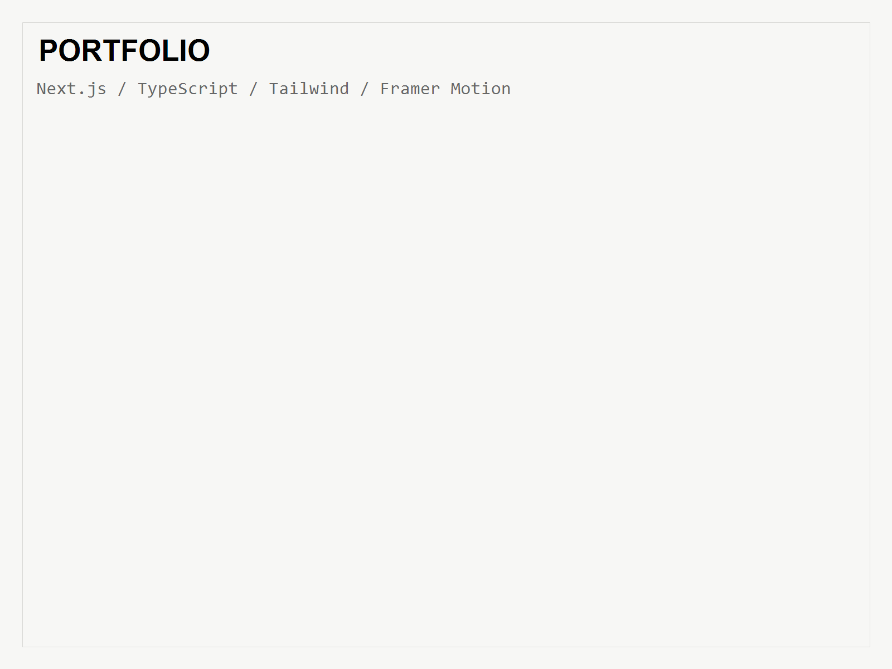

<div align="center">

# Jay Ar Pelicano · Portfolio

> A junior full-stack developer's portfolio — built so a recruiter understands what I can ship in under a minute.

[](https://jayaruuu.vercel.app)
[](https://nextjs.org)
[](https://www.typescriptlang.org)
[](https://tailwindcss.com)
[]()

</div>

## Purpose

A portfolio designed around one question:

> How can a recruiter understand my ability in less than a minute?

It presents Jay Ar as a junior developer who can actually build complete software systems, through strong project case studies rather than generic skill claims.

## Features

- Editorial, black-and-white (Swiss-style) design system
- Data-driven project list with case studies
- Six projects: GSU System, Faura-Farmer, CampusChoice, URDS, Smart Farming, This Portfolio
- Responsive, mobile-first layout
- Restrained animations with `prefers-reduced-motion` support
- SEO: metadata, Open Graph image, sitemap, robots
- Custom cursor (disabled on touch / reduced-motion)
- Accessible semantics and keyboard navigation

## Screenshot



## Tech Stack

| Layer | Technology |
|-------|------------|
| Framework | Next.js 16 (App Router) |
| Language | TypeScript 5 |
| Styling | Tailwind CSS v4 |
| Animation | Framer Motion · GSAP |
| Icons | Lucide React · React Icons |
| Email | Resend |
| Fonts | `next/font` — Space Grotesk + JetBrains Mono |

## Project Structure

```
app/
├── page.tsx              # Homepage
├── layout.tsx            # Root layout + fonts + metadata
├── globals.css           # Design tokens
├── projects/
│   ├── page.tsx          # Projects index
│   └── [slug]/page.tsx   # Dynamic case-study page
├── opengraph-image.tsx   # Generated OG image
├── sitemap.ts
└── robots.ts

components/
├── navigation/           # Sticky nav + mobile menu
├── hero/                 # Hero + portrait
├── projects/             # Selected Work list
├── about/                # About section
├── experience/           # Experience + education
├── skills/               # Skills with project evidence
├── contact/              # Contact CTA
├── footer/
└── ui/                   # Reveal, section heading, cursor, arrow link

data/
├── site.ts               # Personal links + metadata
├── projects.ts           # Project + case-study content
├── skills.ts
└── experience.ts
```

## Getting Started

```bash
npm install
npm run dev
```

Open [http://localhost:3000](http://localhost:3000).

## Commands

| Command            | Description            |
| ------------------ | ---------------------- |
| `npm run dev`      | Development server     |
| `npm run build`    | Production build       |
| `npm run start`    | Serve the build        |
| `npm run lint`     | Run ESLint             |

## Deployment

Deployed on **Vercel** at [jayaruuu.vercel.app](https://jayaruuu.vercel.app).

1. Push this repository to GitHub.
2. Import the repo in [Vercel](https://vercel.com).
3. Set a custom domain if desired.

## Email Setup

The contact form sends messages to `jayarpelicano01@gmail.com` via [Resend](https://resend.com).

1. Create a free Resend account and add your domain (or use their sandbox).
2. Get an **API key** and create a `.env.local` in the project root:

   ```bash
   RESEND_API_KEY=re_xxxxxxxxxxxxxxxxxxxxx
   ```

3. For production delivery, set a verified sender domain in Resend and update the `from` address in `app/api/contact/route.ts` (the default uses `onboarding@resend.dev`, which only sends to your own verified account).
4. In Vercel, add `RESEND_API_KEY` as an environment variable.

## Content Notes

- All portfolio, project, and experience content lives in `data/` and is driven from `data/projects.ts`.
- Replace placeholder project images in `public/images/projects/` with final screenshots.
- Update contact details in `data/site.ts`.

## Author

**Agustin Ronato Pelicano Jr. (Jay Ar)** — Junior & Full-Stack Software Developer

- 🌐 Portfolio: [jayaruuu.vercel.app](https://jayaruuu.vercel.app)
- 💻 GitHub: [@jayarpelicano01](https://github.com/jayarpelicano01)
- 💼 LinkedIn: [agustin-pelicano-jr-77062a3a6](https://www.linkedin.com/in/agustin-pelicano-jr-77062a3a6/)
- ✉️ Email: [jayarpelicano01@gmail.com](mailto:jayarpelicano01@gmail.com)

## License

All rights reserved. Source code is shared for reference and portfolio purposes; it is not licensed for reuse. Add a `LICENSE` file if you intend to open it up.
